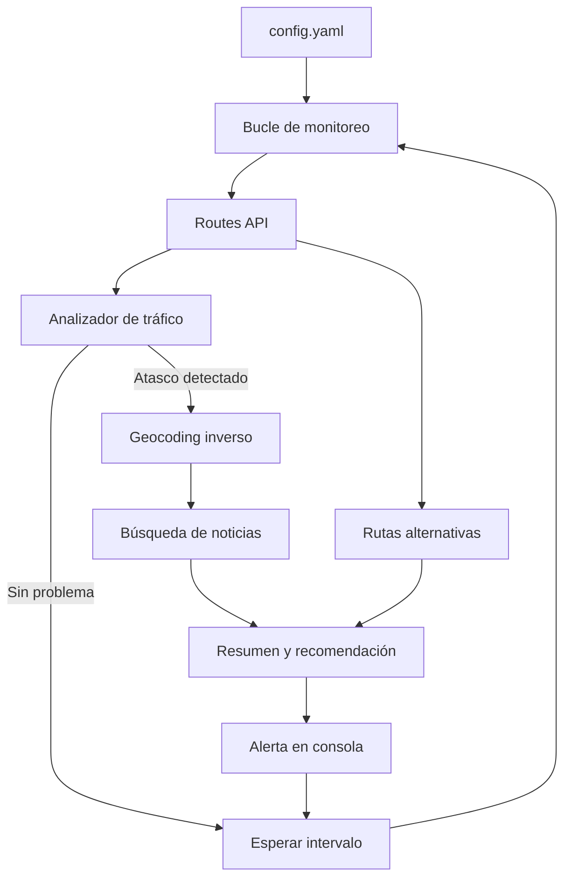

# Route Accident Bot

Bot en Python que monitorea una ruta de Google Maps en tiempo real, detecta congestión severa, investiga posibles accidentes con noticias locales y recomienda si conviene cambiar de ruta.

> **Nota:** La API oficial de Google no expone incidentes etiquetados como "accidente" (eso solo aparece en la app de Google Maps). Este bot detecta **atascos severos + retrasos** y complementa la información buscando noticias en la vía afectada.

---

## Características

- Monitoreo continuo de una ruta (origen → destino)
- Detección de tráfico lento y atascos (`SLOW`, `TRAFFIC_JAM`) vía **Google Routes API v2**
- Geocodificación inversa del punto del atasco
- Búsqueda automática de noticias relacionadas (DuckDuckGo)
- Comparación con rutas alternativas
- Recomendación clara: `MANTENER_RUTA`, `CONSIDERAR_ALTERNATIVA` o `CAMBIAR_RUTA`
- Configuración completa por archivo, sin editar código

---

## Requisitos

- **Python 3.10+**
- Cuenta de [Google Cloud](https://console.cloud.google.com/) con facturación activa
- APIs habilitadas:
  - [Routes API](https://console.cloud.google.com/apis/library/routes.googleapis.com)
  - [Geocoding API](https://console.cloud.google.com/apis/library/geocoding-backend.googleapis.com)
- API Key de Google Maps Platform

---

## Instalación

### 1. Clonar el repositorio

```bash
git clone https://github.com/StreckerMX/route-accident-bot.git
cd route-accident-bot
```

### 2. Crear entorno virtual (recomendado)

```bash
# Windows
python -m venv venv
venv\Scripts\activate

# macOS / Linux
python3 -m venv venv
source venv/bin/activate
```

### 3. Instalar dependencias

```bash
pip install -r requirements.txt
```

### 4. Configurar la API Key

Copia el archivo de ejemplo y agrega tu clave:

```bash
# Windows
copy .env.example .env

# macOS / Linux
cp .env.example .env
```

Edita `.env`:

```env
GOOGLE_MAPS_API_KEY=tu_clave_de_google_maps_aqui
```

### 5. Configurar la ruta a monitorear

Edita `config.yaml`:

```yaml
route:
  origin: "Tu ciudad de origen"
  destination: "Tu ciudad de destino"
  travel_mode: "DRIVE"   # DRIVE | TWO_WHEELER

monitor:
  interval_minutes: 5              # Cada cuántos minutos revisar
  jam_delay_threshold_minutes: 8   # Retraso mínimo para alertar
  cooldown_minutes: 15             # Evita repetir la misma alerta

investigation:
  language: "es"
  max_news_results: 5
  search_queries:
    - "accidente {road} {city}"
    - "choque {road} {city} hoy"
    - "tráfico {road} {city}"

advisor:
  compute_alternatives: true
  recommend_switch_if_saves_minutes: 10
```

---

## Uso

```bash
python main.py
```

El bot revisará la ruta cada `interval_minutes` minutos. Presiona `Ctrl+C` para detenerlo.

### Salida normal (sin problemas)

```
[14:30:00] OK — Ruta: 45 min (+3 min de retraso)
```

### Salida con alerta

```
══════════════════════════════════════════════════
ALERTA DE TRÁFICO — 14:32:15
══════════════════════════════════════════════════
Ubicación: Av. Insurgentes Sur, Ciudad de México
Vía: Avenida Insurgentes Sur
Condición: atasco severo (severidad ALTA)
Retraso estimado: +18 min (ruta total: 52 min)

Investigación:
  • [El Universal] Choque múltiple deja dos carriles cerrados...
  • No se encontraron reportes públicos recientes...

Rutas disponibles:
  • Ruta principal (actual): 52 min (+18 min) — atasco severo
  • Alternativa 1: 39 min (+5 min) — sin atascos severos

Recomendación: CAMBIAR_RUTA
Motivo: La ruta alternativa ahorra ~13 min y no muestra atascos severos.
Ahorro potencial: ~13 min
Mapa: https://www.google.com/maps/dir/?api=1&origin=...
══════════════════════════════════════════════════
```

---

## Cómo obtener la API Key de Google

1. Ve a [Google Cloud Console](https://console.cloud.google.com/)
2. Crea un proyecto nuevo o selecciona uno existente
3. Habilita **Routes API** y **Geocoding API** (enlaces en la sección Requisitos)
4. Ve a **APIs y servicios → Credenciales → Crear credenciales → Clave de API**
5. Restringe la clave solo a las APIs que usa este bot (recomendado)
6. Activa facturación en el proyecto (Google ofrece crédito mensual gratuito)

---

## Estructura del proyecto

```
route-accident-bot/
├── main.py                 # Punto de entrada y bucle de monitoreo
├── config.yaml             # Configuración de ruta y umbrales
├── .env.example            # Plantilla para la API key
├── requirements.txt        # Dependencias Python
├── README.md
└── src/
    ├── routes_client.py    # Cliente Google Routes API v2
    ├── traffic_analyzer.py # Detección de atascos y severidad
    ├── geocoder.py         # Geocodificación inversa
    ├── investigator.py     # Búsqueda de noticias
    ├── route_advisor.py    # Comparación y recomendación de rutas
    └── reporter.py         # Formato de reportes en consola
```

---

## Cómo funciona



1. **Routes API** calcula la ruta con tráfico en tiempo real y devuelve segmentos `NORMAL`, `SLOW` o `TRAFFIC_JAM`.
2. Si el retraso supera el umbral configurado, se toma la coordenada del atasco.
3. **Geocoding API** traduce esa coordenada a calle y ciudad.
4. **Investigator** busca noticias con plantillas configurables.
5. **Route Advisor** compara la ruta principal con alternativas y emite la recomendación.

---

## Parámetros de configuración

| Parámetro | Descripción | Valor por defecto |
|-----------|-------------|-------------------|
| `route.origin` | Punto de partida (dirección o lugar) | — |
| `route.destination` | Destino | — |
| `route.travel_mode` | Modo de viaje (`DRIVE`, `TWO_WHEELER`) | `DRIVE` |
| `monitor.interval_minutes` | Frecuencia de revisión | `5` |
| `monitor.jam_delay_threshold_minutes` | Retraso mínimo para alertar | `8` |
| `monitor.cooldown_minutes` | Tiempo entre alertas repetidas | `15` |
| `investigation.max_news_results` | Máximo de noticias a mostrar | `5` |
| `advisor.recommend_switch_if_saves_minutes` | Minutos de ahorro para recomendar cambio | `10` |

---

## Costos estimados de la API

Con monitoreo cada **5 minutos**:
- ~288 llamadas/día a Routes API (con tráfico, tarifa "Preferred")
- Llamadas adicionales a Geocoding solo cuando hay alerta

Google Maps Platform incluye **crédito mensual gratuito** (consulta [precios actuales](https://mapsplatform.google.com/pricing/)). Para uso personal con un intervalo de 5–10 minutos, normalmente queda dentro del crédito gratuito.

---

## Solución de problemas

| Error | Solución |
|-------|----------|
| `define GOOGLE_MAPS_API_KEY en el archivo .env` | Crea `.env` desde `.env.example` y agrega tu clave |
| `403 PERMISSION_DENIED` | Habilita Routes API y Geocoding API en Google Cloud |
| `Sin rutas disponibles` | Verifica que origen y destino sean direcciones válidas |
| No encuentra noticias | Normal en incidentes recientes no reportados; el bot igual muestra datos de tráfico |
| `Requests quota exceeded` | Aumenta `interval_minutes` en `config.yaml` |

---

## Dependencias

| Paquete | Uso |
|---------|-----|
| `requests` | Llamadas a Google APIs |
| `pyyaml` | Lectura de `config.yaml` |
| `python-dotenv` | Variables de entorno (`.env`) |
| `polyline` | Decodificar polilíneas de la ruta |
| `duckduckgo-search` | Búsqueda de noticias (sin API key adicional) |

---

## Licencia

MIT — Libre para usar, modificar y distribuir.

---

## Contribuciones

Issues y pull requests son bienvenidos. Si mejoras la detección, agregas notificaciones (email, Telegram, etc.) o soporte para múltiples rutas, comparte tu contribución.