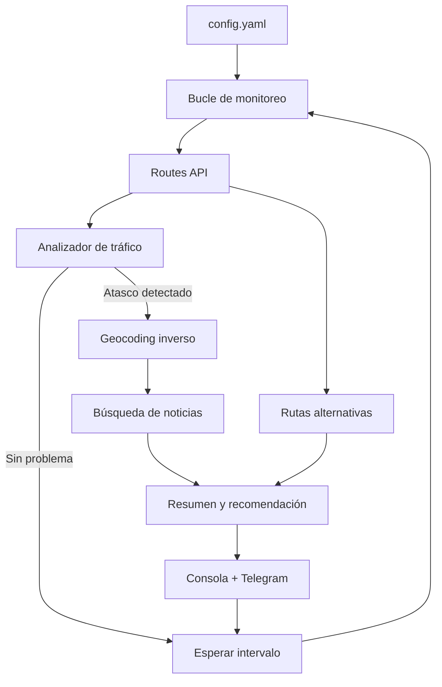

# Route Accident Bot

[](https://www.python.org/)
[](LICENSE)
[](https://github.com/StreckerMX/route-accident-bot/commits/main)
[](https://github.com/StreckerMX/route-accident-bot)
[](https://developers.google.com/maps/documentation/routes)
[](https://core.telegram.org/bots)

Bot en Python que monitorea una ruta de Google Maps en tiempo real, detecta congestión severa, investiga posibles accidentes con noticias locales y recomienda si conviene cambiar de ruta. Soporta **alertas por Telegram**.

> **Nota:** La API oficial de Google no expone incidentes etiquetados como "accidente" (eso solo aparece en la app de Google Maps). Este bot detecta **atascos severos + retrasos** y complementa la información buscando noticias en la vía afectada.

[English version below](#english)

---

## Características

- Monitoreo continuo de una ruta (origen → destino)
- Detección de tráfico lento y atascos (`SLOW`, `TRAFFIC_JAM`) vía **Google Routes API v2**
- Geocodificación inversa del punto del atasco
- Búsqueda automática de noticias relacionadas (DuckDuckGo)
- Comparación con rutas alternativas
- Recomendación clara: `MANTENER_RUTA`, `CONSIDERAR_ALTERNATIVA` o `CAMBIAR_RUTA`
- **Notificaciones por Telegram** en cada alerta
- Configuración completa por archivo, sin editar código

---

## Requisitos

- **Python 3.10+**
- Cuenta de [Google Cloud](https://console.cloud.google.com/) con facturación activa
- APIs habilitadas:
  - [Routes API](https://console.cloud.google.com/apis/library/routes.googleapis.com)
  - [Geocoding API](https://console.cloud.google.com/apis/library/geocoding-backend.googleapis.com)
- API Key de Google Maps Platform
- *(Opcional)* Bot de Telegram para recibir alertas en el celular

---

## Instalación rápida (Windows)

Copia y pega este comando en PowerShell. El instalador [`Install-RouteAccidentBot.ps1`](Install-RouteAccidentBot.ps1) configura todo de forma interactiva:

```powershell
git clone https://github.com/StreckerMX/route-accident-bot.git; cd route-accident-bot; Set-ExecutionPolicy -Scope Process -ExecutionPolicy Bypass; .\Install-RouteAccidentBot.ps1
```

El asistente te pedirá:
1. API Key de Google Maps
2. Origen y destino de la ruta
3. Intervalo de revisión
4. Configuración opcional de Telegram (con mensaje de prueba)

Al terminar, inicia el bot con:
```powershell
.\venv\Scripts\Activate.ps1
python main.py
```

> **Nota sobre `irm ... | iex`:** Existe la opción de ejecutar el instalador directamente desde internet, pero es menos segura porque ejecuta código sin revisarlo. Se recomienda clonar el repositorio primero.

---

## Instalación manual

### 1. Clonar el repositorio

```bash
git clone https://github.com/StreckerMX/route-accident-bot.git
cd route-accident-bot
```

### 2. Crear entorno virtual (recomendado)

```bash
# Windows
python -m venv venv
venv\Scripts\activate

# macOS / Linux
python3 -m venv venv
source venv/bin/activate
```

### 3. Instalar dependencias

```bash
pip install -r requirements.txt
```

### 4. Configurar variables de entorno

```bash
# Windows
copy .env.example .env

# macOS / Linux
cp .env.example .env
```

Edita `.env`:

```env
GOOGLE_MAPS_API_KEY=tu_clave_de_google_maps_aqui

# Opcional — Telegram
TELEGRAM_BOT_TOKEN=tu_token_de_botfather
TELEGRAM_CHAT_ID=tu_chat_id
```

### 5. Configurar la ruta a monitorear

Edita `config.yaml`:

```yaml
route:
  origin: "Tu ciudad de origen"
  destination: "Tu ciudad de destino"
  travel_mode: "DRIVE"   # DRIVE | TWO_WHEELER

monitor:
  interval_minutes: 5
  jam_delay_threshold_minutes: 8
  cooldown_minutes: 15

investigation:
  language: "es"
  max_news_results: 5
  search_queries:
    - "accidente {road} {city}"
    - "choque {road} {city} hoy"

advisor:
  compute_alternatives: true
  recommend_switch_if_saves_minutes: 10

telegram:
  enabled: false          # Cambiar a true para activar
  notify_on_alert: true   # Enviar alertas de tráfico
  notify_on_ok: false     # Enviar mensaje en cada revisión OK (no recomendado)
```

---

## Uso

```bash
python main.py
```

El bot revisará la ruta cada `interval_minutes` minutos. Presiona `Ctrl+C` para detenerlo.

---

## Notificaciones por Telegram

### Paso 1 — Crear el bot

1. Abre Telegram y busca **[@BotFather](https://t.me/BotFather)**
2. Envía `/newbot` y sigue las instrucciones
3. Copia el **token** que te entrega (ej. `7123456789:AAHxxxxxxxxxxxxxxxxxxxxxxxxxxxxxx`)
4. Pégalo en `.env` como `TELEGRAM_BOT_TOKEN`

### Paso 2 — Obtener tu Chat ID

**Opción A — Bot de información**

1. Busca **[@userinfobot](https://t.me/userinfobot)** en Telegram
2. Envíale `/start`
3. Copia tu **Id** numérico (ej. `123456789`)
4. Pégalo en `.env` como `TELEGRAM_CHAT_ID`

**Opción B — API manual**

1. Envía cualquier mensaje a tu bot recién creado (ej. `hola`)
2. Abre en el navegador:
   ```
   https://api.telegram.org/bot<TU_TOKEN>/getUpdates
   ```
3. Busca `"chat":{"id":123456789}` en la respuesta JSON
4. Ese número es tu `TELEGRAM_CHAT_ID`

### Paso 3 — Activar en el bot

1. En `.env`, configura `TELEGRAM_BOT_TOKEN` y `TELEGRAM_CHAT_ID`
2. En `config.yaml`, cambia:
   ```yaml
   telegram:
     enabled: true
     notify_on_alert: true
   ```
3. Ejecuta `python main.py`

Cuando detecte un atasco, recibirás un mensaje como:

```
🚨 ALERTA DE TRÁFICO — 14:32:15

Ubicación: Av. Insurgentes Sur, Ciudad de México
Condición: atasco severo (severidad ALTA)
Retraso: +18 min (total: 52 min)

Investigación:
• [El Universal] Choque múltiple deja dos carriles cerrados...

Rutas:
• Ruta principal (actual): 52 min — atasco
• Alternativa 1: 39 min — sin atasco

Recomendación: CAMBIAR_RUTA
Ver en Google Maps
```

### Solución de problemas — Telegram

| Problema | Solución |
|----------|----------|
| No llegan mensajes | Verifica que enviaste `/start` a tu bot antes de usarlo |
| `telegram.enabled=true` pero no envía | Revisa que `TELEGRAM_BOT_TOKEN` y `TELEGRAM_CHAT_ID` estén en `.env` |
| Error 401 Unauthorized | El token del bot es incorrecto o fue revocado en BotFather |
| Error 400 Bad Request | El `CHAT_ID` es incorrecto; usa el número sin comillas |

---

## Cómo obtener la API Key de Google

1. Ve a [Google Cloud Console](https://console.cloud.google.com/)
2. Crea un proyecto nuevo o selecciona uno existente
3. Habilita **Routes API** y **Geocoding API**
4. Ve a **APIs y servicios → Credenciales → Crear credenciales → Clave de API**
5. Restringe la clave solo a las APIs que usa este bot (recomendado)
6. Activa facturación en el proyecto (Google ofrece crédito mensual gratuito)

---

## Estructura del proyecto

```
route-accident-bot/
├── Install-RouteAccidentBot.ps1  # Instalador interactivo (Windows)
├── main.py                       # Punto de entrada y bucle de monitoreo
├── config.yaml                   # Configuración de ruta y umbrales
├── .env.example                  # Plantilla para API keys
├── requirements.txt
├── README.md
└── src/
    ├── routes_client.py    # Cliente Google Routes API v2
    ├── traffic_analyzer.py # Detección de atascos y severidad
    ├── geocoder.py         # Geocodificación inversa
    ├── investigator.py     # Búsqueda de noticias
    ├── route_advisor.py    # Comparación y recomendación de rutas
    ├── reporter.py         # Formato de reportes
    └── telegram_notifier.py # Envío de alertas a Telegram
```

---

## Cómo funciona



---

## Parámetros de configuración

| Parámetro | Descripción | Default |
|-----------|-------------|---------|
| `route.origin` | Punto de partida | — |
| `route.destination` | Destino | — |
| `monitor.interval_minutes` | Frecuencia de revisión | `5` |
| `monitor.jam_delay_threshold_minutes` | Retraso mínimo para alertar | `8` |
| `telegram.enabled` | Activar notificaciones Telegram | `false` |
| `telegram.notify_on_alert` | Enviar en alertas de tráfico | `true` |
| `advisor.recommend_switch_if_saves_minutes` | Minutos de ahorro para cambiar ruta | `10` |

---

## Solución de problemas

| Error | Solución |
|-------|----------|
| `define GOOGLE_MAPS_API_KEY` | Crea `.env` desde `.env.example` |
| `403 PERMISSION_DENIED` | Habilita Routes API y Geocoding API |
| `Sin rutas disponibles` | Verifica origen y destino en `config.yaml` |
| No encuentra noticias | Normal en incidentes no reportados aún |
| `Requests quota exceeded` | Aumenta `interval_minutes` |

---

## Licencia

MIT — Libre para usar, modificar y distribuir.

---

## Contribuciones

Issues y pull requests son bienvenidos.

---

# English

[](https://www.python.org/)
[](LICENSE)

Python bot that continuously monitors a Google Maps route, detects severe traffic congestion, investigates possible accidents via local news, compares alternative routes, and recommends whether to switch. Supports **Telegram notifications**.

> **Note:** Google's official API does not expose incidents labeled as "accident" (that only appears in the Google Maps app). This bot detects **severe jams + delays** and supplements with news search on the affected road.

---

## Features

- Continuous route monitoring (origin → destination)
- Real-time traffic detection via **Google Routes API v2**
- Reverse geocoding of jam locations
- Automatic news search (DuckDuckGo)
- Alternative route comparison
- Clear recommendations: `MANTENER_RUTA`, `CONSIDERAR_ALTERNATIVA`, or `CAMBIAR_RUTA`
- **Telegram push notifications** on traffic alerts
- Fully configurable via `config.yaml`

---

## Quick Start (Windows)

Copy and paste in PowerShell. The [`Install-RouteAccidentBot.ps1`](Install-RouteAccidentBot.ps1) installer handles setup interactively:

```powershell
git clone https://github.com/StreckerMX/route-accident-bot.git; cd route-accident-bot; Set-ExecutionPolicy -Scope Process -ExecutionPolicy Bypass; .\Install-RouteAccidentBot.ps1
```

Then start the bot:
```powershell
.\venv\Scripts\Activate.ps1
python main.py
```

## Manual Setup (macOS / Linux)

```bash
git clone https://github.com/StreckerMX/route-accident-bot.git
cd route-accident-bot
python3 -m venv venv
source venv/bin/activate
pip install -r requirements.txt
cp .env.example .env   # add GOOGLE_MAPS_API_KEY
# Edit config.yaml with your origin and destination
python main.py
```

---

## Telegram Notifications

### Step 1 — Create a bot

1. Open Telegram and search for **[@BotFather](https://t.me/BotFather)**
2. Send `/newbot` and follow the prompts
3. Copy the **token** (e.g. `7123456789:AAHxxxxxxxxxxxxxxxxxxxxxxxxxxxxxx`)
4. Set it in `.env` as `TELEGRAM_BOT_TOKEN`

### Step 2 — Get your Chat ID

**Option A — Info bot**

1. Search **[@userinfobot](https://t.me/userinfobot)** on Telegram
2. Send `/start`
3. Copy your numeric **Id** (e.g. `123456789`)
4. Set it in `.env` as `TELEGRAM_CHAT_ID`

**Option B — Manual API**

1. Send any message to your new bot (e.g. `hello`)
2. Open in browser:
   ```
   https://api.telegram.org/bot<YOUR_TOKEN>/getUpdates
   ```
3. Find `"chat":{"id":123456789}` in the JSON response
4. That number is your `TELEGRAM_CHAT_ID`

### Step 3 — Enable notifications

1. Set `TELEGRAM_BOT_TOKEN` and `TELEGRAM_CHAT_ID` in `.env`
2. In `config.yaml`:
   ```yaml
   telegram:
     enabled: true
     notify_on_alert: true
   ```
3. Run `python main.py`

You'll receive a formatted alert on your phone whenever severe traffic is detected, including location, news findings, route comparison, and a Google Maps link.

### Telegram troubleshooting

| Issue | Fix |
|-------|-----|
| No messages received | Send `/start` to your bot first |
| `enabled=true` but no sends | Check `TELEGRAM_BOT_TOKEN` and `TELEGRAM_CHAT_ID` in `.env` |
| 401 Unauthorized | Invalid or revoked bot token |
| 400 Bad Request | Wrong `CHAT_ID` — use the numeric ID only |

---

## Requirements

- Python 3.10+
- [Google Cloud](https://console.cloud.google.com/) account with billing
- Enabled APIs: [Routes API](https://console.cloud.google.com/apis/library/routes.googleapis.com), [Geocoding API](https://console.cloud.google.com/apis/library/geocoding-backend.googleapis.com)
- Google Maps Platform API key
- *(Optional)* Telegram bot for mobile alerts

---

## Configuration reference

| Parameter | Description | Default |
|-----------|-------------|---------|
| `route.origin` | Starting point | — |
| `route.destination` | Destination | — |
| `monitor.interval_minutes` | Check frequency (minutes) | `5` |
| `monitor.jam_delay_threshold_minutes` | Min delay to trigger alert | `8` |
| `telegram.enabled` | Enable Telegram notifications | `false` |
| `telegram.notify_on_alert` | Send on traffic alerts | `true` |
| `advisor.recommend_switch_if_saves_minutes` | Min savings to recommend switch | `10` |

---

## License

MIT — Free to use, modify, and distribute.